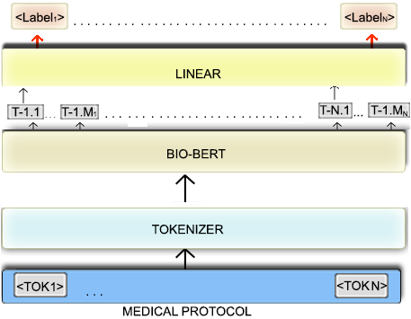

  

     
    <!-- Fine Circle Responsive Image -->
    

      

      

        
      

    

    
{{ site.description }}

  

  

  
  
   
 <b>About me</b>
 
<!-- <h2 style="margin-left:50px;margin-bottom:20px;margin-right:0px;margin-top:0px"><b>About Me</b></h2>

 -->
Hi There! :wave:
  
I am a Masters in Computer Science student at the University of Texas at Austin. I am passionate about Machine Learning and Deep Learning solutions to real-world problems and use-cases. My inclination is towards data in the text, image and audio modalities and I am very interested in large scale pretraining of transformer-based models.
  
I have experiences in Machine Learning applications to Natural Language Processing, Computer Vision, Speech Processing and Multimodal Learning. I have been fortunate to have the opportunity to work and excel on projects during my internships at IBM Research Labs and Google Summer of Code. Academic research at IIT Kharagpur and University of Oregon has helped me get a deeper understanding of the subject. My proficiency in Machine Learning is demonstrated through several publications at the top-tier venues.
  
My experiences developing <a href="softwares/">Open Source software</a> strengthened my software engineering skills and knowledge of systems. These software were presented at the JuliaCon 2020 conference and in the Journal of Open Source software.
  
I have won numerous hackathons and competitions in Machine Learning and AI-related areas - Cogito's 2021 low-latency Speech emotion recognition competition, EMNLP 2020' W-NUT Covid challenge, AllenNLP 2021 hackathon, and Opensoft 2018.
  
I did my Bachelor's degree in Computer Science from Indian Institute of Technology Kharagpur (2017-21). My Bachelor Thesis was under the guidance of <a href="https://scholar.google.com/citations?user=hCbFmUUAAAAJ&hl=en">Prof. Niloy Ganguly</a> on Twitter Stance Detection. It was acclaimed among the Best Bachelor's <a href="https://drive.google.com/drive/u/0/folders/1FmngtkX1AJR2IAT8SPeWQYtKXVrtc0Me">Thesis</a> and a portion of it was <a href="https://aclanthology.org/2021.naacl-main.303.pdf">published</a> to NAACL'21.

 

<link rel="stylesheet" href="https://cdn.jsdelivr.net/gh/jpswalsh/academicons/css/academicons.min.css">     
        
   <pre><a href="https://scholar.google.com/citations?user=HPXkux0AAAAJ&hl=en"> <i class="ai ai-google-scholar ai-2x"></i> </a>  <a href="https://github.com/ayushk4"> <i class="fab fa-2x fa-github"></i></a>   <a href="https://www.linkedin.com/in/ayushk4"> <i class="fab fa-2x fa-linkedin" href="url"></i> </a></pre>
  

 

<!-- <h4 style="text-indent:-0.0em;font-weight:bold;font-size:25px;margin-left:50px;margin-bottom:20px;margin-right:0px;margin-top:0px">News!</h4> -->

<ul style="font-size:19.6px;margin-left:45px">

</ul>

## **News** 
- **September 2021**: Our prompt-engineered GPT-3 based solution for text simplication system won the best design award at AllenNLP' 2021 Hackathon.
- **August 2021**: I am happy to share that our team won the Cogito's 2021 Hackathon on low-latency Speech Emotion Recognition.
- **July 2021**: I will be attending the weeklong Deepmind's Eastern European ML School, look forward to interacting with everyone.
- **June 2021**: Had a wonderful time attending the virtual [NAACL 2021](https://2021.naacl.org/) and presenting (3 + 3 minutes) my paper.
- **May 2021**: My <a href="https://drive.google.com/drive/u/0/folders/1FmngtkX1AJR2IAT8SPeWQYtKXVrtc0Me">Bachelor's Thesis</a> titled "Towards Target Aware Twitter Stance Detection" selected among Best Thesis
- **April 2021**: I will be joining the UT Austin's Computer Science Department this fall as a Master's student.
- **March 2021**: 1 first-author [paper](https://aclanthology.org/2021.naacl-main.303/) accepted at NAACL-HLT 2021.
- **January 2021**: Our submission to [SemEval21 Task-2](https://competitions.codalab.org/competitions/25770) stood runner up.

<a style="float:right; color:#3491fe;" data-toggle="collapse" data-target="#news1"><u>More</u> </a>

<ul>
	<li> <b>November 2020:</b> <a href="https://arxiv.org/abs/2012.10052">1 Oral</a> and <a href="https://arxiv.org/abs/2012.11145">1 paper</a> accepted at EMNLP'20, W-NUT Workshop and won its <a herf="http://noisy-text.github.io/2020/extract_covid19_event-shared_task.html">Shared Task 3</a>.</li>
	<li> <b>August 2020:</b> I was selected to attend <a href="https://sites.google.com/view/aisummerschool2020">Google AI Research</a> School 2020 for Natural Language Understanding Track.</li>
	<li> <b>May 2020:</b> I will be giving a <a href="https://pretalx.com/juliacon2020/talk/Z8WWNV/">talk at JuliaCon</a> Conference 2020 on NLP packages I developed during Google SoC'19.</li>
	<li> <b>April 2020:</b> I am a project mentor at <a href="https://summerofcode.withgoogle.com/projects/#5015442659213312">Google Summer of Code</a> for the project - Albert and statistical language models.</li>
	<li> <b>February 2020:</b> Mentored students in <a href="https://codein.withgoogle.com/archive/"> Google Code In</a>, 2019. 3 of my students were selected as 6 finalists!</li>
	<li> <b>January 2020:</b> 1 <a href="https://www.theoj.org/joss-papers/joss.01956/10.21105.joss.01956.pdf">Paper</a> accepted at Journal of Open Source Software for the work during Google's - SoC  last year.</li>
	<li> <b>December 2019:</b> Awarded <a href="https://github.com/Ayushk4/Resume/blob/master/certificates%20and%20related%20documents/Mitacs_Research_Scholarship.pdf">Globalink Research Scholarship</a> by MITACS and Indo-Canada Shastri.</li>
	<li> <b>August 2019:</b> Had a wonderful summer at <a href="https://summerofcode.withgoogle.com/archive/2019/projects/4945754462879744/">Google Summer of Code</a>, researching on practical Neural sequence labelling models. </li>
</ul>     
 

 

___

<!-- ## Publications and Talks -->

<!-- 

#

*details of the projects can be found* [here](research/)

 -->

<h2 style="margin-left:50px;margin-bottom:20px;margin-right:0px;margin-top:50px"> Publications and Talks </h2>

<ul>
      <li><a target="_blank" href="https://aclanthology.org/2021.naacl-main.303.pdf">
        "<i style="font-family:sans-serif">t</i> WT—WT: Asserting the Role of Targets for Detecting Stance in Tweets"</a>  <i> Ayush Kaushal, Avirup Saha and Niloy Ganguly </i> 
              Proceedings of the 2021 Conference of the North American Chapter of the Association for Computational Linguistics: Human Language Technologies (<b>NAACL-HLT 2021</b>)
               
                  
              <a style="float:right; color:#3491fe;" data-toggle="collapse" data-target="#biasstance"><u>More</u> </a>
        </li>
        

          The stance detection task aims at detecting the stance of a tweet or a text for a target. These targets can be named entities or free-form sentences (claims). Though the task involves reasoning of the tweet with respect to a target, we find that it is possible to achieve high accuracy on several publicly available Twitter stance detection datasets without looking at the target sentence. Specifically, a simple tweet classification model achieved human-level performance on the WT–WT dataset and more than two-third accuracy on various other datasets. We investigate the existence of biases in such datasets to find the potential spurious correlations of sentiment-stance relations and lexcal choice associated with the stance category. Furthermore, we propose a new large dataset free of such biases and demonstrate its aptness on the existing stance detection systems. Our empirical findings show much scope for research on the stance detection task and proposes several considerations for creating future stance detection datasets.
             
        

         

    <li><a target="_blank" href="https://www.aclweb.org/anthology/2020.wnut-1.79.pdf">
              "Leveraging Event Specific and Chunk Span features to Extract COVID Events from tweets"</a>   <i>Ayush Kaushal and Tejas Vaidhya </i> 
              <b><u>Oral Presentation</u></b> at the 6th Workshop on Noisy User-generated Text (W-NUT) at the 2020 Conference on Emperical Methods in Natural Language Processing (EMNLP 2020) <u><b>Shared Task Winners</b></u>
               
                  {% include elements/button.html link="https://github.com/noisy-text/noisy-text.github.io/blob/master/2020/posters/WNUT2020_91_poster%20-%20Tejas%20vaidhya.pdf" text="Poster" %}
              
              <a style="float:right; color:#3491fe;" data-toggle="collapse" data-target="#covid"><u>More</u> </a>
      </li>
        
Twitter has acted as an important source of information during disasters and pandemic, especially during the times of COVID-19. In this paper, we describe our system entry for <i>WNUT 2020 Shared Task-3</i>. The task was aimed at automating the extraction of a variety of COVID-19 related events from Twitter, such as individuals who recently contracted the virus, someone with symptoms who were denied testing and believed remedies against the infection. The system consists of separate multi-task models for slot-filling subtasks and sentence-classification subtasks while leveraging the useful sentence-level information for the corresponding event. The system uses COVID-Twitter-Bert with attention-weighted pooling of candidate slot-chunk features to capture the useful information chunks. The system ranks <b>1st at the leader-board</b> with F1 of 0.6598, without using any ensembles or additional datasets.    
      

         

    <li><a target="_blank" href="https://drive.google.com/file/d/1oAn378KMU-cIUrXcVc0clZ_7PuwlX_Zb/view?usp=sharing">
              "Causal Direction in Data Matters: Implications of Causal and Anticausal Learning in NLP",</a>   <i>Zhijing Jin, Julius von Kügelgen, Jingwei Ni, Tejas Vaidhya, Ayush Kaushal, Mrinmaya Sachan and Bernhard Schoelkopf </i> 
              <u><b>Long Paper</b></u> at the 2021 Conference on Emperical Methods in Natural Language Processing (EMNLP 2021)
               
                 
              
              <a style="float:right; color:#3491fe;" data-toggle="collapse" data-target="#covid"><u>More</u> </a>
      </li>
        
Twitter has acted as an important source of information during disasters and pandemic, especially during the times of COVID-19. In this paper, we describe our system entry for <i>WNUT 2020 Shared Task-3</i>. The task was aimed at automating the extraction of a variety of COVID-19 related events from Twitter, such as individuals who recently contracted the virus, someone with symptoms who were denied testing and believed remedies against the infection. The system consists of separate multi-task models for slot-filling subtasks and sentence-classification subtasks while leveraging the useful sentence-level information for the corresponding event. The system uses COVID-Twitter-Bert with attention-weighted pooling of candidate slot-chunk features to capture the useful information chunks. The system ranks <b>1st at the leader-board</b> with F1 of 0.6598, without using any ensembles or additional datasets.    
      

         

      <li><a target="_blank" href="https://aclanthology.org/2021.semeval-1.46.pdf">
              "Multi-Staged Language Models for Extracting Measurements, their Attributes and Relations"</a> <i> Neel Karia*, Ayush Kaushal* and Faraaz Mallick* </i> 
              15th International Workshop on Semantic Evaluation (SemEval'21) at ACL-IJCNLP'21 <u><b>Second Runner-up</b></u>
               
                 
              <a style="float:right; color:#3491fe;" data-toggle="collapse" data-target="#semeval21"><u>More</u> </a>
      </li>
        
SemEval-2021 Task 8: MeasEval aims at improving the machine understanding of measurements in scientific texts through a set of entity and semantic relation extraction sub-tasks on identifying quantity spans along with various attributes and relationships. This paper describes our system, consisting of a three-stage pipeline, that leverages pre-trained language models to extract the quantity spans in the text, followed by intelligent templates to identify units and modifiers. Finally, it identifies the quantity attributes and their relations using language models boosted with a feature re-using hierarchical architecture and multi-task learning. Our submission significantly outperforms the baseline, with the best model from the post-evaluation phase delivering more than 100% increase on F1 (Overall) from the baseline.    
      

         

    <li><a target="_blank" href="https://www.aclweb.org/anthology/2020.wnut-1.34.pdf">
              "Domain specific BERT representation for Named Entity Recognition of lab protocol."</a>
               <i>Tejas Vaidhya and Ayush Kaushal</i> 
              Proceedings of the 6th Workshop on Noisy User-generated Text (W-NUT) at the 2020 Conference on Emperical Methods in Natural Language Processing (EMNLP 2020)
               
                 {% include elements/button.html link="https://github.com/noisy-text/noisy-text.github.io/blob/master/2020/posters/WNUT2020_92_poster%20-%20Tejas%20vaidhya.pdf" text="Poster" %}

              <a style="float:right;color:#3491fe" data-toggle="collapse" data-target="#wetlab"><u>More</u></a>
      </li>
        

        <!--  
        

             
            
 -->
            Supervised models trained to predict properties from representations, have been achieving high accuracy on a variety of tasks. For instance, the BERT family seems to work exceptionally well on the downstream task from NER tagging to the range of other linguistic tasks. But the vocabulary used in the medical field contains a lot of different tokens used only in the medical industry such as the name of different diseases, devices, organisms, medicines, etc. that makes it difficult for traditional BERT model to create contextualized embedding. In this paper, we are going to illustrate the System for Named Entity Tagging based on Bio-Bert. Experimental results show that our model gives substantial improvements over the baseline and stood the fourth runner up in terms of F1 score, and first runner up in terms of Recall among 13 teams with just 2.21 F1 score behind the best one.
               
        

         

    <li><a target="_blank" href="https://www.theoj.org/joss-papers/joss.01956/10.21105.joss.01956.pdf">
              "Basic Tools for Tokenizing Natural Language in Julia."</a>
               <i>Ayush Kaushal, Lyndon White, Mike Innes, Rohit Kumar</i> 
              The Journal of Open Source Software (JOSS) 2020
               
                 
              <a style="float:right;color:#3491fe" data-toggle="collapse" data-target="#joss2020"><u>More</u></a>
      </li>
        

        <!-- 

             
            
 -->
            WordTokenizers.jl is a tool to help users of the Julia programming language work with natural language. WordTokenizers.jl provides a flexible API for defining fast tokenizers and sentence segmentors. Using this API several standard tokenizers and sentence segmenters have been implemented, allowing researchers and practitioners to focus on the higher details of their NLP tasks. WordTokenizers.jl uses a TokenBuffer API and its various lexers for fast word tokenization. TokenBuffer turns the string into a readable stream. A desired set of TokenBuffer lexers are used to read characters from the stream and flush out into an array of tokens. The package provides the following tokenizers made using this API. WordTokenizers.jl is currently being used by packages like TextAnalysis.jl, Transformers.jl and CorpusLoaders.jl for tokenizing text.
               
        

         

    <li><a target="_blank" href="https://drive.google.com/file/d/1iNqtbP9h9d6acqpS8cw-BwzAib2Ldf3C/view?usp=sharing">
              "Towards Target Aware Twitter Stance Detection."</a>
               <i>Ayush Kaushal</i> 
              Bachelor's Thesis, IIT Kharagpur
               
                 
              <a style="float:right;color:#3491fe" data-toggle="collapse" data-target="#bachelorsthesis"><u>More</u></a>
      </li>
        

        <!-- 

             
            
 -->
            The stance of a text is the attitude or standpoint of the author towards an entity or a debate topic. Stance Detection is the Natural Language Understanding (NLU) task to automatically detect the stance of a text for a given target. The targets are either named entities such as policies, politicians, or as free-form sentences such as popular debate topics, rumoured online claims or article headlines. Over the past few years, a considerable attention has been given to research on Stance Detection Systems. Several large scale datasets have also been proposed on a variety of domains to promote the progress of the field and to provide reliable benchmarks.

            In this project, we first study the role of the target entities in detecting stance and based on our findings move towards target aware stance detection systems. We mainly analyse the various publicly available stance detection datasets on tweets. In these datasets, the text is a tweet and targets are either fixed entities or naturally occurring free-form sentences. Empirical findings show that despite the task requiring significant amount of understanding of the target being considered, one can easily achieve impressive performance by doing simple target-agnostic classification over a tweet. Specifically, we observe that a simple tweet classification model achieved near-human upper bound performance on a large scale dataset (WT-WT). These classification models can also achieve more than two-third of accuracy on 6 other Twitter stance detection datasets. Then, an analysis of some of the datasets is carried out to explain the existence of such biases in such datasets. We find some spurious correlations between tweet sentiment and stance classes. These datasets additionally have a set of lexical choices associated with their respective stance category. Consequently, we propose novel methods to augment the var ious existing stance detection dataset to inhibit target oblivious models from performing well and evaluated the dataset’s usefulness on the stance detection baseline models. With these proper benchmarks, we propose and experiment with several target aware stance detection models and show that taking into consideration, the target aware cues, the models deliver state of the art performance. Finally, we create a leaderboard for the newly created datasets and make our code, datasets and pre-trained models publicly available.
               
        

         

    <li><a target="_blank" href="https://www.youtube.com/watch?v=hHCi8ojazqk">
              "Natural Language Processing in Julia."</a>
               <i>Ayush Kaushal </i> 
              JuliaCon 2020 Conference Full Talk (30 min)
               
                
              <a style="float:right;color:#3491fe" data-toggle="collapse" data-target="#juliacontalk"><u>More</u></a>
      </li>
        

          The JuliaText ecosystem provides various packages for working with human languages. In this talk, I showed the usage of these JuliaText packages with Flux.jl for Natural Language Processing (NLP) with a focus on deep learning-based approaches. The attendees will gain working knowledge about how to apply the package for NLP in Julia. The talk will encompass Tokenizers, Word Embeddings, Recurrent Neural Networks and Transformer based Language models.
            

        

         
</ul>

<h2> Other Selected Projects </h2>



<h3 style="margin-left:25px;margin-bottom:0px;margin-top:50px"> Contact</h3>

<i>Email: username at gmail dot com ; where username = ayushk4</i> 

